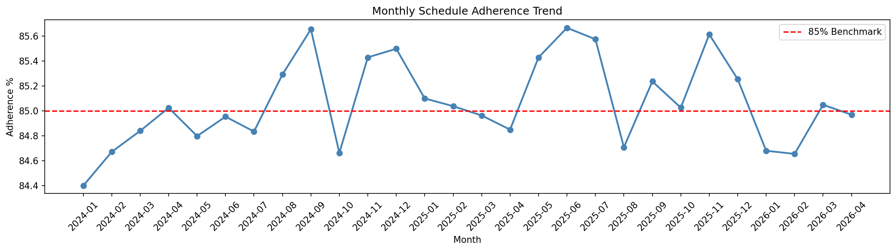
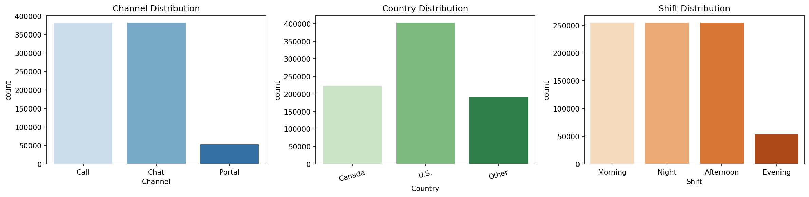
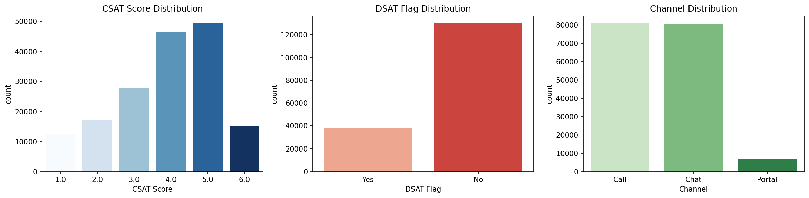
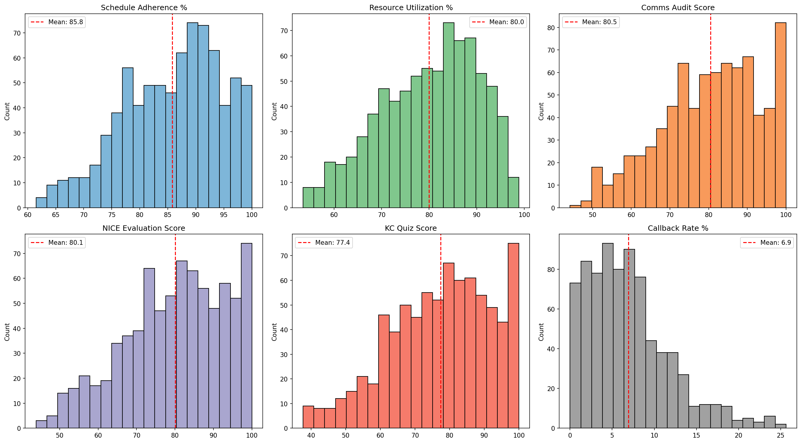
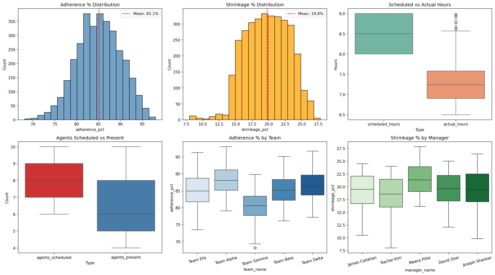

# NovaBridge Solutions — BPO Analytics Dashboard

---

## 📌 Project Overview
End-to-end data analytics project simulating a real-world BPO/CSR 
operation serving US and Canadian clients. Built to demonstrate 
production-level Data Analyst skills across the complete pipeline — 
from raw messy data generation to a stakeholder-ready Power BI dashboard.

---

## 🛠️ Tech Stack
| Tool | Purpose |
|---|---|
| Python (pandas, matplotlib, seaborn) | Data generation, EDA, KPI calculation |
| MySQL (MySQL Workbench) | Data storage, SQL cleaning |
| Power BI | Interactive 5-page dashboard |
| SQLAlchemy | Direct MySQL → Python connection |
| AI (Claude, ChatGPT) | Code review, DAX generation, debugging |

---

## 📂 Project Structure

---

## 📊 Dataset
Synthetic data generated using Faker and pandas.
**No real customer data used.**

| Table | Raw Rows | Clean Rows | Description |
|---|---|---|---|
| interaction | 1,000,000 | 817,384 | Call, chat, portal interactions |
| performance | 861 | 787 | Agent monthly performance metrics |
| survey_report | 209,510 | 168,515 | Customer satisfaction surveys |
| schedule_adherence | 3,472 | 3,301 | Team workforce scheduling |

---

## 🔄 Pipeline

1. Python → generate_novabridge_data.py → 4 raw CSV files
                        
2. MySQL → Import raw CSVs → SQL cleaning scripts → 4 clean tables
                        
3. Python → EDA_Nova_Bridge.ipynb → Exploratory Data Analysis
                        
4. Python → KPI_Calculation.ipynb → KPI calculation + CSV export
                        
5. Power BI → NovaBridge_Solutions_Dashboard.pbix → 5-page dashboard

---

## 🧹 Data Quality Issues Handled
| Issue | Action |
|---|---|
| 7 mixed date formats | Unified to YYYY-MM-DD via STR_TO_DATE() |
| NULL values in critical columns | Dropped or filled with realistic defaults |
| Inconsistent casing and whitespace | TRIM() + LOWER() + title case |
| Duplicate primary keys | ROW_NUMBER() — kept first occurrence |
| Negative values in numeric columns | Set to NULL — row retained |
| Inconsistent categorical values | CASE standardisation |
| Wrong data types on MySQL import | CAST() to correct types |
| 1M row timeout in MySQL | Batched inserts via interaction_deduped |

---

## 📈 Dashboard Pages
| Page | Key Visuals |
|---|---|
| Executive Summary | KPI cards, monthly trend, channel split, disposition donut |
| Interaction Analysis | AHT by team, dispositions, shift distribution, callback by channel |
| Customer Satisfaction | CSAT/DSAT trend, by country, channel, manager |
| Agent Performance | Adherence by team, AHT by agent, KC & NICE trend |
| Schedule & Workforce | Adherence & shrinkage trend, team comparisons, staffing |

---

## 📌 Key KPI Findings
| KPI | Value | Benchmark | Status |
|---|---|---|---|
| Total Interactions | 817,384 | — | — |
| Resolution Rate | 31.80% | 70-75% | 🔴 Below benchmark |
| Avg CSAT Score | 3.88 / 6 | 75%+ | 🔴 Below benchmark |
| DSAT Rate | 22.81% | < 15% | 🔴 Above benchmark |
| Avg Handle Time | 20.2 mins | 6-8 mins | 🔴 Above benchmark |
| Callback Rate | 25.13% | < 10% | 🔴 Above benchmark |
| Schedule Adherence | 85.07% | 85% | 🟢 At benchmark |
| KC Quiz Score | 77.40 | 80+ | 🟡 Training gap |
| Shrinkage | 19.76% | 20-35% | 🟢 Within range |
| Absenteeism | 18.08% | 5-10% | 🔴 Above benchmark |

---

## 👥 Team Performance Ranking
| Rank | Team | Adherence | Avg AHT | Rating |
|---|---|---|---|---|
| 🥇 1 | Team Delta | 90.72% | 509 secs | Top performer |
| 🥈 2 | Team Beta | 86.86% | 657 secs | Mid-high |
| 🥉 3 | Team Alpha | 84.46% | 862 secs | Mid-low |
| 🔴 4 | Team Gamma | 80.86% | 1,019 secs | Needs coaching |

---

## 📖 Data Dictionary
| Value | Meaning |
|---|---|
| `Appreciation` | Mapped from `follow-up required` during SQL cleaning |
| `Evening` shift | Placeholder for NULL shift values during cleaning |
| `Portal` channel | Placeholder for NULL channel values during cleaning |
| `Other` country | NULL or unrecognised country values |
| `Team Eta` | Placeholder team for NULL team_name values |
| `Joseph Shankar` | Placeholder manager added during NULL handling |
| `Avinash Maurya` | Placeholder manager — later reassigned to Joseph Shankar |

---

## 🚀 How to Run This Project

> ⚠️ CSV files are not included in this repository due to file size limits.
> Run the data generator to create them locally.

1. Clone this repository: [Click Here](Data_Generator/generate_novabridge.py)  
2. Install the following libraries: pandas, numpy, faker, sqlalchemy, mysql-connector-python, python-dotenv
3. Generate raw data files: `generate_novabridge.py`
4. This creates 4 CSV files:
   - `interaction_file.csv` — 1,000,000 rows
   - `performance_file.csv` — ~861 rows
   - `survey_report.csv` — ~209,510 rows
   - `schedule_adherence_file.csv` — ~3,472 rows
5. Import CSVs into MySQL
   - Open MySQL Workbench
   - Create a database called `nova_bridge`
   - Import each CSV as a new table
6. Run SQL cleaning scripts in order
   - `Source_Code/SQL/Cleaned/01_interaction_cleaning.sql`
   - `Source_Code/SQL/Cleaned/02_performance_cleaning.sql`
   - `Source_Code/SQL/Cleaned/03_survey_cleaning.sql`
   - `Source_Code/SQL/Cleaned/04_schedule_adherence_cleaning.sql`
7. Run Python notebooks
   - Open `Source_Code/Python/EDA_Nova_Bridge.ipynb`
   - Update MySQL credentials in the connection cell
   - Run all cells
   - Open `Source_Code/Python/KPI_Calculation.ipynb`
   - Run all cells — exports final CSVs to `Finalized/` folder
8. Open Power BI dashboard
   - Open `Source_Code/NovaBridge_Solutions_Dashboard.pbix`
   - Update data source path to your local `Finalized/` folder
   - Click **Home → Refresh**

> ⚠️ **Note:** Update MySQL username, password and database name in the Python notebooks before running.

---

## 📸 Dashboard Screenshots

### Executive Summary

### Interaction Analysis

### Customer Satisfaction

### Agent Performance

### Schedule & Workforce

---

## 👤 Author
**Abishek** | Aspiring Data Analyst
Currently transitioning from Customer Service Representative at Wipro
into a Data Analyst role.

